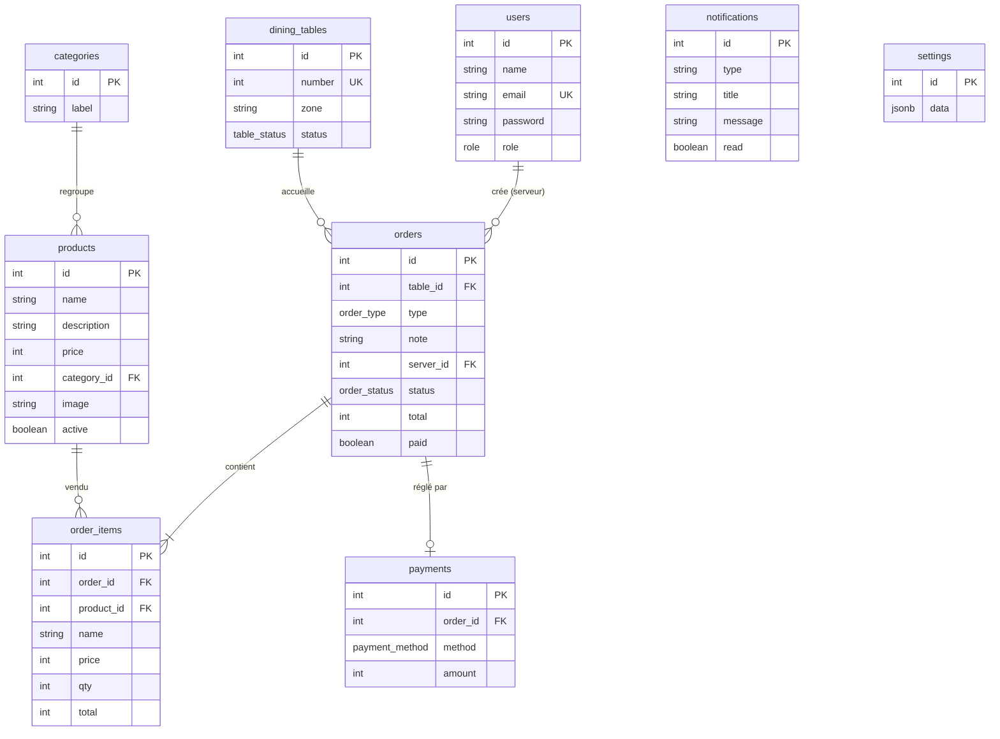
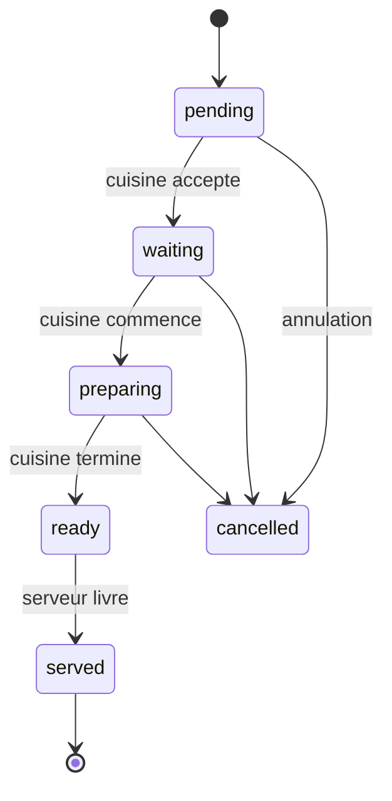

# Backend — Tola Taste (Laravel)

> Documentation d'architecture backend Laravel : base de données (tables, attributs, contraintes),
> modèles Eloquent et relations, logique des contrôleurs.

---

## 1. Stack technique

- **Langage / runtime** : PHP 8.2+
- **Framework** : Laravel 11 (Eloquent ORM)
- **Base de données** : PostgreSQL 15+ (ou MySQL 8)
- **Auth** : Laravel Sanctum (tokens) + bcrypt
- **Validation** : Form Requests Laravel
- **Temps réel** : Laravel Reverb / Broadcasting pour le flux cuisine ↔ serveur

**Rôles** (`users.role`) :
`client` · `serveur` · `cuisine` · `manager` · `admin`

Hiérarchie : `admin` > `manager` > `serveur` / `cuisine` > `client`

Structure Laravel prévue :

```
app/
├── Http/
│   ├── Controllers/
│   │   ├── Api/
│   │   │   ├── AuthController.php
│   │   │   ├── UserController.php
│   │   │   ├── CategoryController.php
│   │   │   ├── ProductController.php
│   │   │   ├── TableController.php
│   │   │   ├── OrderController.php
│   │   │   ├── PaymentController.php
│   │   │   ├── NotificationController.php
│   │   │   └── SettingsController.php
│   │   └── Controller.php
│   ├── Middleware/
│   │   └── CheckRole.php          # garde par rôle (hiérarchie)
│   └── Requests/                  # Form Requests (validation)
├── Models/
│   ├── User.php
│   ├── Category.php
│   ├── Product.php
│   ├── Table.php                  # table = dining_tables
│   ├── Order.php
│   ├── OrderItem.php
│   ├── Payment.php
│   ├── Notification.php
│   └── Settings.php
├── Events/
│   └── OrderStatusChanged.php     # broadcast Reverb
routes/api.php
database/migrations/
database/seeders/
```

---

## 2. Diagramme relationnel (Mermaid)



---

## 3. Migrations — tables et attributs

### 3.1 `users`

| Attribut | Type / colonne | Contraintes | Description |
|---|---|---|---|
| `id` | `bigIncrements` | `PK` | Identifiant unique |
| `name` | `string(120)` | `NOT NULL` | Nom complet |
| `email` | `string(180)` | `NOT NULL`, `unique` | Email de connexion |
| `password` | `string(255)` | `NOT NULL` | Mot de passe haché (bcrypt) |
| `role` | `enum(['client','serveur','cuisine','manager','admin'])` | `NOT NULL`, défaut `'client'` | Rôle / niveau d'accès |

```php
Schema::create('users', function (Blueprint $table) {
    $table->id();
    $table->string('name', 120);
    $table->string('email', 180)->unique();
    $table->string('password', 255);
    $table->enum('role', ['client', 'serveur', 'cuisine', 'manager', 'admin'])->default('client');
    $table->index('role');
    $table->timestamps();
});
```

---

### 3.2 `categories`

| Attribut | Type / colonne | Contraintes | Description |
|---|---|---|---|
| `id` | `bigIncrements` | `PK` | Identifiant unique |
| `label` | `string(80)` | `NOT NULL`, `unique` | Libellé affiché |

```php
Schema::create('categories', function (Blueprint $table) {
    $table->id();
    $table->string('label', 80)->unique();
    $table->timestamps();
});
```

---

### 3.3 `products`

| Attribut | Type / colonne | Contraintes | Description |
|---|---|---|---|
| `id` | `bigIncrements` | `PK` | Identifiant unique |
| `name` | `string(140)` | `NOT NULL` | Nom du produit |
| `description` | `string(255)` | `NOT NULL` | Description courte |
| `price` | `unsignedInteger` | `NOT NULL` | Prix en FCFA |
| `category_id` | `foreignId` | `NOT NULL`, `FK → categories.id`, `RESTRICT` | Catégorie |
| `image` | `string(255)` | nullable | URL de l'image |
| `active` | `boolean` | défaut `true` | Disponible à la vente |

```php
Schema::create('products', function (Blueprint $table) {
    $table->id();
    $table->string('name', 140);
    $table->string('description', 255);
    $table->unsignedInteger('price');
    $table->foreignId('category_id')->constrained()->restrictOnDelete();
    $table->string('image', 255)->nullable();
    $table->boolean('active')->default(true);
    $table->index(['category_id', 'active']);
    $table->timestamps();
});
```

---

### 3.4 `dining_tables`

| Attribut | Type / colonne | Contraintes | Description |
|---|---|---|---|
| `id` | `bigIncrements` | `PK` | Identifiant unique |
| `number` | `unsignedSmallInteger` | `NOT NULL`, `unique` | Numéro de table |
| `zone` | `string(40)` | `NOT NULL`, défaut `'Salle'` | Salle / Terrasse / VIP |
| `status` | `enum(['free','occupied'])` | `NOT NULL`, défaut `'free'` | Libre / occupée |

```php
Schema::create('dining_tables', function (Blueprint $table) {
    $table->id();
    $table->unsignedSmallInteger('number')->unique();
    $table->string('zone', 40)->default('Salle');
    $table->enum('status', ['free', 'occupied'])->default('free');
    $table->index('status');
    $table->timestamps();
});
```

---

### 3.5 `orders`

| Attribut | Type / colonne | Contraintes | Description |
|---|---|---|---|
| `id` | `bigIncrements` | `PK` | Identifiant unique |
| `table_id` | `foreignId nullable` | `FK → dining_tables.id`, `SET NULL` | Table (si sur place) |
| `type` | `enum(['dine_in','takeaway'])` | `NOT NULL`, défaut `'takeaway'` | Type |
| `note` | `string(255)` | nullable | Remarque |
| `server_id` | `foreignId nullable` | `FK → users.id`, `SET NULL` | Serveur qui a pris la commande |
| `status` | `enum(['pending','waiting','preparing','ready','served','cancelled'])` | `NOT NULL`, défaut `'pending'` | État |
| `total` | `unsignedInteger` | défaut `0` | Total de la commande |
| `paid` | `boolean` | défaut `false` | Réglée |

```php
Schema::create('orders', function (Blueprint $table) {
    $table->id();
    $table->foreignId('table_id')->nullable()->constrained('dining_tables')->nullOnDelete();
    $table->enum('type', ['dine_in', 'takeaway'])->default('takeaway');
    $table->string('note', 255)->nullable();
    $table->foreignId('server_id')->nullable()->constrained('users')->nullOnDelete();
    $table->enum('status', ['pending', 'waiting', 'preparing', 'ready', 'served', 'cancelled'])->default('pending');
    $table->unsignedInteger('total')->default(0);
    $table->boolean('paid')->default(false);
    $table->index(['status', 'created_at']);
    $table->timestamps();
});
```

**Machine à états** (`pending → waiting → preparing → ready → served` ; `cancelled` avant `served`) :



---

### 3.6 `order_items`

| Attribut | Type / colonne | Contraintes | Description |
|---|---|---|---|
| `id` | `bigIncrements` | `PK` | Identifiant unique |
| `order_id` | `foreignId` | `NOT NULL`, `FK → orders.id`, `CASCADE` | Commande parente |
| `product_id` | `foreignId nullable` | `FK → products.id`, `SET NULL` | Produit vendu |
| `name` | `string(140)` | `NOT NULL` | Snapshot du nom |
| `price` | `unsignedInteger` | `NOT NULL` | Snapshot du prix unitaire |
| `qty` | `unsignedSmallInteger` | `NOT NULL` | Quantité |
| `total` | `unsignedInteger` | `NOT NULL` | `price × qty` |

```php
Schema::create('order_items', function (Blueprint $table) {
    $table->id();
    $table->foreignId('order_id')->constrained()->cascadeOnDelete();
    $table->foreignId('product_id')->nullable()->constrained()->nullOnDelete();
    $table->string('name', 140);
    $table->unsignedInteger('price');
    $table->unsignedSmallInteger('qty');
    $table->unsignedInteger('total');
    $table->index('order_id');
    $table->timestamps();
});
```

---

### 3.7 `payments`

| Attribut | Type / colonne | Contraintes | Description |
|---|---|---|---|
| `id` | `bigIncrements` | `PK` | Identifiant unique |
| `order_id` | `foreignId` | `NOT NULL`, `unique`, `FK → orders.id`, `CASCADE` | Commande réglée (1:1) |
| `method` | `enum(['cash','card','orange_money','wave'])` | `NOT NULL` | Moyen de paiement |
| `amount` | `unsignedInteger` | `NOT NULL` | Montant perçu |

```php
Schema::create('payments', function (Blueprint $table) {
    $table->id();
    $table->foreignId('order_id')->unique()->constrained()->cascadeOnDelete();
    $table->enum('method', ['cash', 'card', 'orange_money', 'wave']);
    $table->unsignedInteger('amount');
    $table->timestamps();
});
```

---

### 3.8 `notifications`

| Attribut | Type / colonne | Contraintes | Description |
|---|---|---|---|
| `id` | `bigIncrements` | `PK` | Identifiant unique |
| `type` | `string(20)` | `NOT NULL` | `success` / `warning` / `danger` / `info` |
| `title` | `string(120)` | `NOT NULL` | Titre court |
| `message` | `string(255)` | `NOT NULL` | Corps du message |
| `read` | `boolean` | défaut `false` | Notification lue |
| `created_at` | `timestamp` | défaut `now()` | Date de création |

```php
Schema::create('notifications', function (Blueprint $table) {
    $table->id();
    $table->string('type', 20);
    $table->string('title', 120);
    $table->string('message', 255);
    $table->boolean('read')->default(false);
    $table->index('read');
    $table->timestamp('created_at')->useCurrent();
});
```

---

### 3.9 `settings`

Paramètre du restaurant (une seule ligne, cf. `stores/settings.ts`).

| Attribut | Type / colonne | Contraintes | Description |
|---|---|---|---|
| `id` | `unsignedSmallInteger` | `PK`, `CHECK (id = 1)` | Une seule ligne |
| `data` | `json` | `NOT NULL` | Configuration complète |

```php
Schema::create('settings', function (Blueprint $table) {
    $table->smallInteger('id')->primary();
    $table->json('data');
});
```

Exemple de `data` :

```json
{
  "restaurantName": "Tola Taste",
  "restaurantAddress": "Cotonou, Bénin",
  "restaurantPhone": "+229 01 90 00 00 00",
  "restaurantEmail": "contact@tola.taste",
  "currency": "FCFA",
  "taxRate": 0,
  "defaultTableCount": 12,
  "paymentMethods": ["especes", "mobile_money", "carte", "mixte"],
  "autoPrintKitchen": true,
  "autoPrintBill": true
}
```

---

## 4. Modèles Eloquent et relations

### 4.1 `User`

```php
// app/Models/User.php
class User extends Authenticatable
{
    use HasApiTokens, HasFactory, Notifiable;

    public const ROLE_CLIENT   = 'client';
    public const ROLE_SERVEUR  = 'serveur';
    public const ROLE_CUISINE  = 'cuisine';
    public const ROLE_MANAGER  = 'manager';
    public const ROLE_ADMIN    = 'admin';

    protected $fillable = ['name', 'email', 'password', 'role'];

    protected $hidden = ['password', 'remember_token'];   // jamais renvoyé en JSON

    protected function casts(): array
    {
        return ['password' => 'hashed'];
    }

    // commandes prises par le serveur
    public function orders(): HasMany
    {
        return $this->hasMany(Order::class, 'server_id');
    }

    public function isStaff(): bool
    {
        return $this->role !== self::ROLE_CLIENT;
    }
}
```

**Hiérarchie de rôles** (à utiliser dans le middleware `CheckRole`) :

```php
// app/Models/User.php
public const ROLE_LEVEL = [
    'client'  => 0,
    'serveur' => 1,
    'cuisine' => 1,
    'manager' => 2,
    'admin'   => 3,
];

public function canAccess(string $requiredRole): bool
{
    return self::ROLE_LEVEL[$this->role] >= self::ROLE_LEVEL[$requiredRole];
}
```

---

### 4.2 `Category`

```php
class Category extends Model
{
    protected $fillable = ['label'];

    public function products(): HasMany
    {
        return $this->hasMany(Product::class);
    }
}
```

---

### 4.3 `Product`

```php
class Product extends Model
{
    protected $fillable = ['name', 'description', 'price', 'category_id', 'image', 'active'];

    protected function casts(): array
    {
        return ['price' => 'integer', 'active' => 'boolean'];
    }

    // liste publique : toujours les produits actifs
    public function scopeActive(Builder $query): Builder
    {
        return $query->where('active', true);
    }

    public function category(): BelongsTo
    {
        return $this->belongsTo(Category::class);
    }
}
```

---

### 4.4 `Table`

> Modèle nommé `Table` (pour `dining_tables`). Attention au mot réservé MySQL → indiquer le nom de table.

```php
class Table extends Model
{
    protected $table = 'dining_tables';

    protected $fillable = ['number', 'zone', 'status'];

    public const STATUS_FREE     = 'free';
    public const STATUS_OCCUPIED = 'occupied';

    protected function casts(): array
    {
        return ['status' => 'string'];
    }

    // historique des commandes passées sur la table
    public function orders(): HasMany
    {
        return $this->hasMany(Order::class, 'table_id');
    }

    public function free(): void
    {
        $this->update(['status' => self::STATUS_FREE]);
    }

    public function occupy(): void
    {
        $this->update(['status' => self::STATUS_OCCUPIED]);
    }
}
```

---

### 4.5 `Order`

```php
class Order extends Model
{
    protected $fillable = [
        'table_id', 'type', 'note', 'server_id', 'status', 'total', 'paid',
    ];

    public const STATUS_PENDING    = 'pending';
    public const STATUS_WAITING    = 'waiting';
    public const STATUS_PREPARING  = 'preparing';
    public const STATUS_READY      = 'ready';
    public const STATUS_SERVED     = 'served';
    public const STATUS_CANCELLED  = 'cancelled';

    // transitions autorisées depuis chaque état
    public const TRANSITIONS = [
        self::STATUS_PENDING   => [self::STATUS_WAITING, self::STATUS_CANCELLED],
        self::STATUS_WAITING   => [self::STATUS_PREPARING, self::STATUS_CANCELLED],
        self::STATUS_PREPARING => [self::STATUS_READY, self::STATUS_CANCELLED],
        self::STATUS_READY     => [self::STATUS_SERVED],
        self::STATUS_SERVED    => [],
        self::STATUS_CANCELLED => [],
    ];

    protected function casts(): array
    {
        return ['paid' => 'boolean', 'total' => 'integer'];
    }

    public function table(): BelongsTo
    {
        return $this->belongsTo(Table::class, 'table_id');
    }

    public function server(): BelongsTo
    {
        return $this->belongsTo(User::class, 'server_id');
    }

    public function items(): HasMany
    {
        return $this->hasMany(OrderItem::class);
    }

    public function payment(): HasOne
    {
        return $this->hasOne(Payment::class);
    }

    /** Recalcule le total à partir des lignes. */
    public function recomputeTotal(): void
    {
        $this->total = $this->items->sum('total');
    }

    public function canTransitionTo(string $newStatus): bool
    {
        return in_array($newStatus, self::TRANSITIONS[$this->status] ?? [], true);
    }

    public function isActive(): bool
    {
        return ! in_array($this->status, [self::STATUS_SERVED, self::STATUS_CANCELLED]);
    }
}
```

---

### 4.6 `OrderItem`

```php
class OrderItem extends Model
{
    protected $fillable = ['order_id', 'product_id', 'name', 'price', 'qty', 'total'];

    protected function casts(): array
    {
        return ['price' => 'integer', 'qty' => 'integer', 'total' => 'integer'];
    }

    public function order(): BelongsTo
    {
        return $this->belongsTo(Order::class);
    }

    public function product(): BelongsTo
    {
        return $this->belongsTo(Product::class);
    }
}
```

---

### 4.7 `Payment`

```php
class Payment extends Model
{
    protected $fillable = ['order_id', 'method', 'amount'];

    protected function casts(): array
    {
        return ['amount' => 'integer'];
    }

    public function order(): BelongsTo
    {
        return $this->belongsTo(Order::class);
    }
}
```

---

### 4.8 `AppNotification`

```php
class AppNotification extends Model // table `notifications`
{
    public $timestamps = false;

    protected $fillable = ['type', 'title', 'message', 'read'];

    protected function casts(): array
    {
        return ['read' => 'boolean'];
    }
}
```

---

### 4.9 `Settings`

```php
class Settings extends Model
{
    public $incrementing = false;   // id fixe = 1
    protected $keyType = 'string';
    protected $table = 'settings';
    public $timestamps = false;

    protected $fillable = ['id', 'data'];

    protected function casts(): array
    {
        return ['data' => 'array'];
    }

    public static function config(): array
    {
        return self::firstOrCreate(['id' => 1], ['data' => []])->data;
    }

    public static function put(array $data): Settings
    {
        $s = self::firstOrCreate(['id' => 1], ['data' => []]);
        $s->update(['data' => array_merge($s->data ?? [], $data)]);
        return $s;
    }
}
```

---

### 4.10 Relations récapitulatives

| # | Relation | Cardinalité | Côté porteur | Delete |
|---|---|---|---|---|
| 1 | `User.orders()` (serveur) | 1 — N | `orders.server_id` | `nullOnDelete` |
| 2 | `Table.orders()` | 1 — N | `orders.table_id` | `nullOnDelete` |
| 3 | `Category.products()` | 1 — N | `products.category_id` | `restrictOnDelete` |
| 4 | `Product.orderItems()` | 1 — N | `order_items.product_id` | `nullOnDelete` (snapshot) |
| 5 | `Order.items()` | 1 — N | `order_items.order_id` | `cascadeOnDelete` |
| 6 | `Order.payment()` | 1 — 1 | `payments.order_id` (unique) | `cascadeOnDelete` |

**Règle de snapshot** : `order_items.name/price` sont copiés à la création pour préserver l'historique
même si le menu change ensuite.

---

## 5. Middleware de rôles et routes

### 5.1 `CheckRole` (middleware)

```php
// app/Http/Middleware/CheckRole.php
public function handle(Request $request, Closure $next, string ...$roles): Response
{
    $user = $request->user();

    // hiérarchie : admin est accepté partout, manager accepte serveur/cuisine, etc.
    foreach ($roles as $role) {
        if ($user && $user->canAccess($role)) {
            return $next($request);
        }
    }

    abort(403, "Accès interdit : rôle insuffisant ({$user?->role ?? 'invité'}).");
}
```

### 5.2 `routes/api.php`

```php
Route::prefix('v1')->group(function () {

    // Auth — public
    Route::post('auth/register', [AuthController::class, 'register']);
    Route::post('auth/login',    [AuthController::class, 'login']);

    // Lecture publique
    Route::get('products',    [ProductController::class, 'index']);
    Route::get('products/{product}', [ProductController::class, 'show']);
    Route::get('categories',  [CategoryController::class, 'index']);

    // Routes authentifiées
    Route::middleware('auth:sanctum')->group(function () {
        Route::get('auth/me', [AuthController::class, 'me']);
        Route::post('auth/logout', [AuthController::class, 'logout']);

        // Client : commander en ligne (takeaway)
        Route::post('orders', [OrderController::class, 'store']);

        // Staff (serveur, manager, admin)
        Route::middleware('role:serveur')->group(function () {
            Route::post('orders',              [OrderController::class, 'store']);
            Route::get('orders',               [OrderController::class, 'index']);
            Route::get('orders/{order}',       [OrderController::class, 'show']);
            Route::patch('orders/{order}/status', [OrderController::class, 'updateStatus']);
            Route::patch('tables/{table}/status', [TableController::class, 'updateStatus']);
            Route::get('payments/unpaid',      [PaymentController::class, 'unpaid']);
            Route::post('payments',            [PaymentController::class, 'store']);
            Route::get('notifications',        [NotificationController::class, 'index']);
            Route::patch('notifications/{notification}/read', [NotificationController::class, 'markRead']);
        });

        // Cuisine (changement de statut)
        Route::middleware('role:cuisine')->group(function () {
            Route::patch('orders/{order}/status', [OrderController::class, 'updateStatus']);
        });

        // Manager & admin
        Route::middleware('role:manager')->group(function () {
            Route::get('users',             [UserController::class, 'index']);
            Route::get('users/staff',       [UserController::class, 'staff']);
            Route::get('payments',          [PaymentController::class, 'index']);

            // Gestion du menu
            Route::resource('products', ProductController::class)->except(['index', 'show']);
            Route::resource('categories', CategoryController::class)->except('index');
        });

        // Admin uniquement
        Route::middleware('role:admin')->group(function () {
            Route::get('tables',                 [TableController::class, 'index']);
            Route::post('tables',                [TableController::class, 'store']);
            Route::patch('tables/{table}',       [TableController::class, 'update']);
            Route::delete('tables/{table}',      [TableController::class, 'destroy']);
            Route::post('users',                 [UserController::class, 'store']);
            Route::patch('users/{user}',         [UserController::class, 'update']);
            Route::delete('users/{user}',        [UserController::class, 'destroy']);
            Route::patch('settings',             [SettingsController::class, 'update']);
        });
    });
});
```

---

## 6. Contrôleurs et logique métier

### 6.1 `AuthController` — `/api/auth`

**Logique `login`** :
1. `Auth::attempt($credentials)` sur `email` + `password`.
2. Échec → `422` (« Identifiants incorrects »).
3. Générer un token Sanctum (`$user->createToken('mobile')->plainTextToken`).
4. Retourner `{ token, user: $user->only('id','name','email','role') }` — jamais le `password`.

**Logique `register`** :
1. Valider via `RegisterRequest` : `name`, `email` (unique), `password` (min 6, confirmé).
2. Créer le `User` avec `role: 'client'` (hash géré par le cast `'password' => 'hashed'`).
3. Retourner `201` + user sans mot de passe.

---

### 6.2 `UserController` — `/api/users`

| Méthode | Route | Rôles | Description |
|---|---|---|---|
| `GET` | `/api/users` | manager, admin | Liste (filtrable par rôle) |
| `GET` | `/api/users/staff` | manager, admin | Staff uniquement (`role ≠ client`) |
| `POST` | `/api/users` | admin | Créer un utilisateur staff |
| `PATCH` | `/api/users/{user}` | admin | Modifier (nom, rôle, email, mot de passe) |
| `DELETE` | `/api/users/{user}` | admin | Supprimer |

**Logique** :
- `store` : exiger `role ∈ {serveur, cuisine, manager, admin}` ; vérifier l'email unique.
- `update` : ne changer le mot de passe que si un `password` est fourni.
- `destroy` : interdire la suppression de soi-même (`Request::user()->id === $user->id` → `409`).

---

### 6.3 `CategoryController` — `/api/categories`

| Méthode | Route | Rôles | Description |
|---|---|---|---|
| `GET` | `/api/categories` | public | Liste |
| `POST` | `/api/categories` | manager, admin | Créer |
| `PATCH` | `/api/categories/{category}` | manager, admin | Modifier |
| `DELETE` | `/api/categories/{category}` | manager, admin | Supprimer |

**Logique `destroy`** : refuser si des produits actifs appartiennent à la catégorie → `409` (RESTRICT).

---

### 6.4 `ProductController` — `/api/products`

| Méthode | Route | Rôles | Description |
|---|---|---|---|
| `GET` | `/api/products` | public | Liste (toujours `active=true`) |
| `GET` | `/api/products/{product}` | public | Détail |
| `POST` | `/api/products` | manager, admin | Créer |
| `PATCH` | `/api/products/{product}` | manager, admin | Modifier |
| `DELETE` | `/api/products/{product}` | manager, admin | Supprimer |

**Logique** :
- Lecture publique : `Product::active()`.
- `destroy` : `$product->update(['active' => false])` pour conserver l'historique des commandes.

Form Request `ProductRequest` :
```php
public function rules(): array
{
    return [
        'name'        => ['required', 'string', 'max:140'],
        'description' => ['required', 'string', 'max:255'],
        'price'       => ['required', 'integer', 'min:0'],
        'category_id' => ['required', 'exists:categories,id'],
        'image'       => ['nullable', 'image', 'max:2048'], // ou une URL
        'active'      => ['nullable', 'boolean'],
    ];
}
```

---

### 6.5 `TableController` — `/api/tables`

| Méthode | Route | Rôles | Description |
|---|---|---|---|
| `GET` | `/api/tables` | admin | Liste + statut |
| `POST` | `/api/tables` | admin | Ajouter (`number`, `zone`) |
| `PATCH` | `/api/tables/{table}` | admin | Modifier |
| `PATCH` | `/api/tables/{table}/status` | serveur, manager, admin | Changer le statut |
| `DELETE` | `/api/tables/{table}` | admin | Supprimer |

**Logique `updateStatus`** :
```php
$table->update(['status' => $request->validated('status')]);   // free | occupied
```
- Encourager l'automatique : `$table->occupy()` appelé dans `OrderController::store` quand `table_id` est fourni.
- `destroy` : refuser si `status === 'occupied'` (commande en cours) → `409`.

---

### 6.6 `OrderController` — `/api/orders`

**Logique `store` (`POST /api/orders`)** :
1. Reconstruire les lignes depuis les produits (jamais depuis le client) — produits inactifs refusés → `422`.
2. `total = Σ (price × qty)`.
3. Transaction : créer la commande + ses lignes, puis `$order->recomputeTotal()` + `save()`.
4. Si `table_id` et source serveur : `$order->table->occupy()`.
5. Dispatch `OrderStatusChanged::dispatch($order)` (broadcast kitchen).

```php
$order = DB::transaction(function () use ($data) {
    $order = Order::create([
        'table_id'  => $data['table_id'] ?? null,
        'type'      => $data['type'],
        'note'      => $data['note'] ?? null,
        'server_id' => $request->user()->id,
        'status'    => $data['source'] === 'serveur' ? Order::STATUS_PREPARING : Order::STATUS_PENDING,
    ]);
    $order->items()->createMany($items);
    $order->recomputeTotal();
    $order->save();
    return $order;
});
```

**Logique `updateStatus` (`PATCH /api/orders/{order}/status`)** :
1. Vérifier `$order->canTransitionTo($new)` → sinon `409`.
2. `ready` réservé à la cuisine ; `served` interdit à la cuisine.
3. Mettre à jour le statut ; si `cancelled` → `paid = false` + `table->free()`.
4. Broadcast `OrderStatusChanged`.

---

### 6.7 `PaymentController` — `/api/payments`

| Méthode | Route | Rôles | Description |
|---|---|---|---|
| `GET` | `/api/payments/unpaid` | serveur, manager, admin | Commandes `served` non réglées |
| `POST` | `/api/payments` | serveur, manager, admin | Encaisser |
| `GET` | `/api/payments` | manager, admin | Historique (période) |

**Logique `store` (`POST /api/payments`)** :
1. Commande doit être `served` → sinon `409` ; pas déjà `paid` → `409` ; montant ≥ total → sinon `422`.
2. Transaction : créer le paiement, `paid = true`, libérer la table.
3. Retourner la commande + le montant rendu.

```php
DB::transaction(function () use ($order, $request) {
    $order->payment()->create([
        'method' => $request->validated('method'),
        'amount' => $request->validated('amount'),
    ]);
    $order->update(['paid' => true]);
    $order->table?->free();
});
```

---

### 6.8 `NotificationController` — `/api/notifications`

| Méthode | Route | Rôles | Description |
|---|---|---|---|
| `GET` | `/api/notifications` | staff | Notifications non lues en premier |
| `PATCH` | `/api/notifications/{notification}/read` | staff | Marquer lue |

```php
public function index(Request $request): JsonResponse
{
    return response()->json(
        AppNotification::orderByDesc('created_at')->get()
    );
}
```

La **génération** est déclenchée par les contrôleurs (commande créée, statut changé, encaissement) et
poussée via Reverb (`Broadcast::on('orders')`).

---

### 6.9 `SettingsController` — `/api/settings`

| Méthode | Route | Rôles | Description |
|---|---|---|---|
| `GET` | `/api/settings` | staff | Config complète |
| `PATCH` | `/api/settings` | admin | Merge partiel |

**Logique `update`** :
```php
Settings::put($request->validated());   // merge du JSON (ligne id = 1)
```

---

## 7. Seeders (données initiales)

Reproduire l'état de démo du front :

```php
// database/seeders/DatabaseSeeder.php
public function run(): void
{
    Settings::put([
        'restaurantName' => 'Tola Taste',  'restaurantAddress' => 'Cotonou, Bénin',
        'restaurantPhone'=> '+229 01 90 00 00 00', 'restaurantEmail' => 'contact@tola.taste',
        'currency' => 'FCFA', 'taxRate' => 0, 'defaultTableCount' => 12,
        'paymentMethods' => ['especes', 'mobile_money', 'carte', 'mixte'],
        'autoPrintKitchen' => true, 'autoPrintBill' => true,
    ]);

    // Comptes de démo (hash bcrypt automatique via cast 'hashed')
    User::create(['name' => 'Admin Tola',    'email' => 'admin@tolataste.com',  'password' => 'admin123',     'role' => 'admin']);
    User::create(['name' => 'Jean Gérant',   'email' => 'manager@tolataste.com','password' => 'manager123',   'role' => 'manager']);
    User::create(['name' => 'Sophie Serveur','email' => 'sophie@tolataste.com', 'password' => 'serveur123',   'role' => 'serveur']);
    User::create(['name' => 'Chef Mamadou',  'email' => 'cuisine@tolataste.com','password' => 'cuisine123',   'role' => 'cuisine']);

    // 10 tables réparties Salle / Terrasse / VIP
    foreach ([
        [1,'Salle'],[2,'Salle'],[3,'Salle'],[4,'Salle'],
        [5,'Terrasse'],[6,'Terrasse'],[7,'Terrasse'],
        [8,'VIP'],[9,'VIP'],[10,'Salle'],
    ] as [$num, $zone]) {
        Table::create(['number' => $num, 'zone' => $zone]);
    }
}
```

Le seed du **menu** (catégories + produits de `src/data/menu.ts`) peut être généré par une boucle sur
les catégories (`Omelettes`, `Chocolats`, `Thés & Infusions`, `Plats authentiques`,
`Accompagnements`, `Jus nature`) et leurs produits avec `active = true`.

---

## 8. Flux de bout en bout (récapitulatif)

### Client en ligne (takeaway)
1. `GET /api/products` → affichage du menu (seulement `active`).
2. `POST /api/orders` (statut `pending`) → broadcast kitchen + notification.
3. Cuisine : `PATCH /api/orders/{id}/status` → `waiting` → `preparing` → `ready` → broadcast serveur.
4. Serveur : `PATCH ... /status` → `served`.
5. Encaissement : `POST /api/payments` → table libérée.

### En salle (serveur)
1. `POST /api/orders` (`table_id` + table `occupy()`, statut `preparing`).
2. Suivi : `GET /api/orders` (filtres statut/jour).
3. Même flux cuisine → encaissement.

---

## 9. Règles transverses

- **Prix en FCFA (int)** : éviter les flottants pour les montants.
- **Snapshots** : `order_items.name/price` figés à la création.
- **Sécurité** : jamais de `password` dans les réponses JSON (`$hidden`) ; tokens Sanctum ; secrets en `.env`.
- **Transactions** : `DB::transaction` pour commande + lignes, encaissement + libération de table.
- **Temps réel** : mutations d'état → `OrderStatusChanged` (broadcast, Reverb) sur les canaux
  `orders`/`kitchen`/`serveur`.
- **Rôles** : middleware `role:` + `User::canAccess()` (hiérarchie admin > manager > serveur/cuisine > client).
